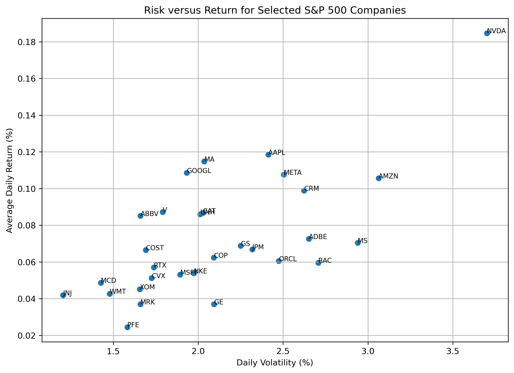
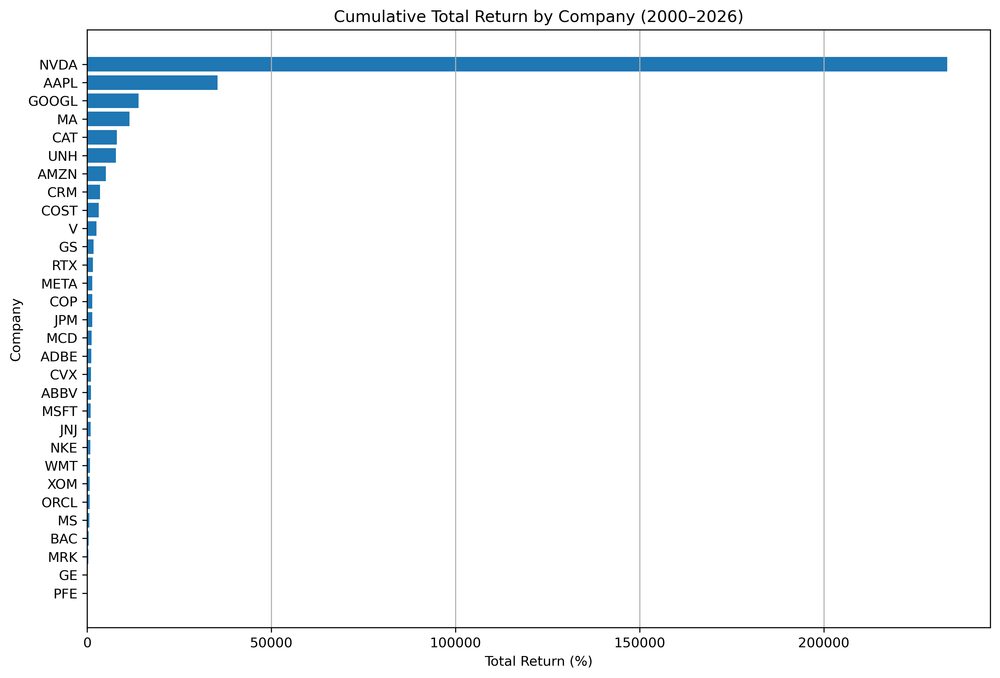

# 📈 S&P 500 Momentum Analysis

## Project Overview

This project investigates whether historical market winners exhibited characteristics consistent with the momentum investing hypothesis by analysing the historical performance of 30 large-cap S&P 500 companies between 2000 and 2026.

Using a combination of **SQL** and **Python**, the project validates, prepares and analyses more than **187,000 daily stock observations** to examine long-term returns, daily performance, investment risk and risk-adjusted returns.

The findings are discussed in relation to the **momentum investing hypothesis** and the **weak-form Efficient Market Hypothesis (EMH)**.

---

## Project Objectives

- Validate and prepare historical stock market data.
- Analyse long-term investment performance.
- Calculate average daily returns.
- Measure investment risk using daily volatility.
- Evaluate risk-adjusted performance using the Sharpe Ratio.
- Investigate whether historical market winners exhibited characteristics consistent with momentum investing.
- Discuss the findings in relation to the weak-form Efficient Market Hypothesis.

---

## 🛠 Technologies Used

| Technology | Purpose |
|------------|---------|
| Python | Data preparation and financial analysis |
| Pandas | Data cleaning, transformation and analysis |
| Matplotlib | Data visualisation |
| SQL (SQLite) | Data validation and exploratory analysis |
| DB Browser for SQLite | SQL query execution |
| Jupyter Notebook | Interactive analysis and documentation |
| Visual Studio Code | Project development |
| Git & GitHub | Version control and portfolio hosting |

---

## 📂 Dataset

The project analyses historical daily stock market data for **30 large-cap S&P 500 companies** covering the period:

- **Start Date:** 3 January 2000
- **End Date:** 22 June 2026

The final dataset contains:

- **187,343 daily observations**
- **30 companies**
- **7 variables**

### Variables

| Column | Description |
|---------|-------------|
| date | Trading date |
| open | Opening stock price |
| high | Highest trading price |
| low | Lowest trading price |
| close | Closing stock price |
| volume | Daily trading volume |
| symbol | Stock ticker |

---

## 📋 Project Workflow

The project was completed in four stages:

### 1. Data Preparation

- Imported historical stock market data into Python.
- Converted date variables into datetime format.
- Prepared the dataset for time-series analysis.

### 2. SQL Data Validation

- Verified dataset completeness.
- Checked for duplicate records.
- Identified missing values.
- Validated trading date ranges.
- Examined company coverage.
- Calculated descriptive statistics.

### 3. Python Financial Analysis

- Calculated daily percentage returns.
- Calculated average daily returns.
- Measured daily volatility using the standard deviation of returns.
- Calculated the Sharpe Ratio.
- Compared investment performance against investment risk.
- Produced visualisations of historical investment performance.

### 4. Interpretation

The findings were interpreted in the context of:

- Momentum investing.
- Risk versus return.
- Risk-adjusted performance.
- The weak-form Efficient Market Hypothesis (EMH).

---

## 📊 Key Analysis Performed

### SQL Analysis

The SQL stage focused on validating the dataset and producing descriptive statistics before financial analysis began.

Key SQL analyses included:

- Dataset validation and completeness checks
- Duplicate record detection
- Missing value analysis
- Trading date validation
- Company record counts
- Average closing price by company
- Average daily trading volume
- Historical price ranges
- Total investment return calculations
- Compound Annual Growth Rate (CAGR)

### Python Analysis

Python was used to calculate investment performance metrics and produce visualisations.

Key analyses included:

- Daily return calculation
- Average daily return by company
- Daily volatility (standard deviation of returns)
- Risk versus return comparison
- Sharpe Ratio calculation
- Historical investment performance analysis
- Momentum investing discussion

---

## 🔍 Key Findings

The analysis produced several important findings:

- **NVDA** generated the highest cumulative investment return over the sample period, substantially outperforming every other company in the dataset.
- **NVDA** also recorded the highest average daily return but experienced the highest daily volatility, illustrating the relationship between higher returns and greater investment risk.
- **Mastercard (MA)** achieved the highest Sharpe Ratio, indicating the strongest risk-adjusted performance despite not producing the highest cumulative return.
- The risk-versus-return analysis suggested a positive relationship between investment return and volatility across the selected companies.
- Technology companies dominated the highest-performing group, reflecting the sector's exceptional long-term growth between 2000 and 2026.
- The findings were broadly consistent with characteristics associated with momentum investing; however, this project did not perform a formal momentum trading backtest and therefore cannot conclusively confirm or reject the momentum hypothesis.
- The analysis also highlighted that the highest-return investment was not necessarily the most efficient investment once risk was considered.

---

## 📁 Repository Structure

```
SQL S&P ANALYSIS/
│
├── README.md
├── Data/
│   ├── sp500_stocks.csv
│   ├── sp500_companies.csv
│   └── sp500_stocks_selected.csv
│
├── Images/
│
├── Notebooks/
│   ├── data_preparation.ipynb
│   └── analysis_results.ipynb
│
├── SQL/
│   └── 01_data_validation.sql
│
└── sp500_stock_analysis.db
```

---

## 📈 Visualisations

The project includes several visualisations created using Matplotlib to support the analysis.

### Risk versus Return

Illustrates the relationship between average daily return and daily volatility for each company.



---

### Historical Investment Performance

Ranks all companies according to their cumulative investment return over the sample period.



---

## 💼 Skills Demonstrated

Throughout this project, the following technical skills were applied:

### SQL

- Data validation
- Aggregation
- Grouping
- Sorting
- Common Table Expressions (CTEs)
- Financial calculations

### Python

- Pandas
- Data transformation
- Time-series analysis
- Statistical analysis
- Data visualisation
- DataFrame merging
- Financial performance analysis

### Analytical Skills

- Exploratory data analysis
- Risk analysis
- Investment performance evaluation
- Data interpretation
- Financial reporting

## ✅ Conclusion

This project demonstrates an end-to-end analytical workflow using SQL and Python to investigate historical stock market performance.

The analysis combines data validation, financial calculations, statistical analysis and data visualisation to evaluate long-term investment performance, investment risk and risk-adjusted returns.

The findings are broadly consistent with characteristics associated with momentum investing while also highlighting the importance of considering risk when evaluating investment performance.

Although this project does not implement a formal momentum trading strategy, it provides a structured exploratory analysis and demonstrates practical SQL, Python and data analysis skills that are directly applicable to data analyst roles.


